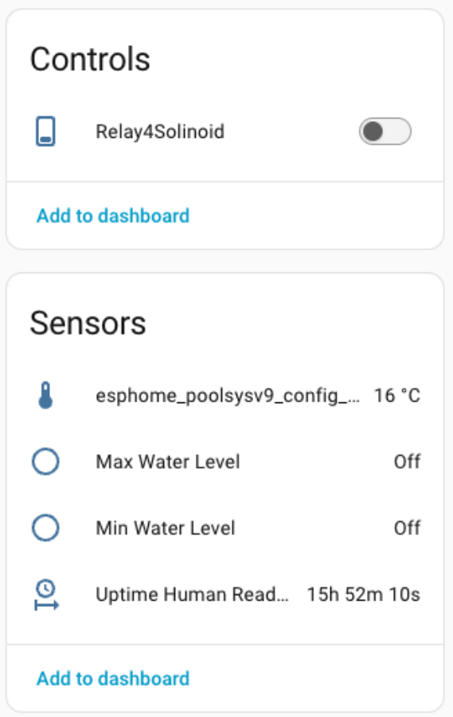

## The opportunity

We also have a summer vacation property. If we are away long enough - things can get clogged or water levels can change leading to more issues. Ofcourse chemical balance is also important but that will be for some future automation.

## The "Phase one" automation

Things I thought would be helpful to measure were: Temperature both in and out of the pool, Humidity, whether the pool water level was getting too high or worse; too low. I also wanted a way to fill the pool while I was away or for convenience. I know that sounds a bit risky but I figured I would just give my self a maximum range away like at the cottage when controlling water levels knowing I can get home within a few hours and not days. All of this assumes someone from the family is skimming the pool and availabkle to shut the water off if needed.   

## The build

There have been, as usual, several iterations of build. Starting it's brains with ESP8266 and now in the more current ESP32. The idea was initially to monitor pool water temp, external temp, and the upper and lower levels of pool water. Why - well I had some issues with a leak once and it almost caused the pump to run dry and that would be in the +$3,000 range to fix. I also want to know if the rain and other filling sources cause the water to go too high well before it flows over the edge and leaks in between liner causing more issues or worse the water makes it's way to the  house. Temperature of course is more something my wife wants to know before she commits to a swim in the morning, reminding me that 80 F is a happy wife scenario.   Finally, I wanted a display on the controller for quick viewing if I don't have my phone handy. Meanwhile I had built a second small system to power the Pool Light GFI controls - more on that in later iterations.

### First iteration 

The larger design issues here were: Power safety - for the solenoid used to start/stop water flow, weather proofing the gear, corrosion resistance and distance between the pool and the controller .

Sensing water depth, it turns out, has several possible methods with some being "touch-less" but bulky and others being more complex like that used in water etc. tank applications. I thought I would keep things simple ands just use a four channel moister sensor (using 2 here) -LC1BD04 board I had on hand for a few dollars from Aliexpress. The concept is simple: each electrode pair is measured for resistance and sets that board channel to high (with an LED too) when the electrode pair encounters resistance like water. Each electrode pair sits at it's base along the line of what I decide is the high and low water mark. Then came the water temp sensor which I chose to use DS18B20 Temperature Sensor Probe 304 Stainless Steel. So that requied a total of 7 contacts to be able to get to the pool which is about 10 feet away. I was lucky to be able to lay a simple corrugated pipe from the area of the controller to the pool and sort of hide it next to my old-school diving-board. I used a basic 0.96 OLED to show both pool and local temp as well ar water level status. I ran a hose along with that corrugated wire pipe to the pool from the solenoid so it just sits for filling. I used a pex pipe to hold a wire probe ends and hide the thermo in it which seemed to work well and was small enough not to look too DIY.

### Automations

I had HA sense water levels and notify me and I had an important automation that turned off the solenoid after 30 min operation no matter what turned it on.

### *The experience*

This is the crux of the design process - what does the user experience and what's the feedback. Well U used the system for 2 years and the Solenoid automation saved me from myself a few times as did the level indicators. My wife love the fact she could yell at me to turn the heater on any time too LOL. 

But... after a two seasons,  corrosion destroyed the level sensors and the system needed repair. Why? I simply did not think them through nor was I aware that salt water pool water can really corrode copper and solder ends. 


### Second Iteration 

The other thing I thought was a bit inefficient was the fact that 


## Parts

* ESP32
* 30Amp 240V max SLA-05VDC-SL-C relay
* 0.96 OLED
* DS18B20 Temperature Sensor Probe 304 Stainless Steel
* Four channel moister sensor (using 2 here) -LC1BD04 
* 240VAC -5VDC power converter (Modified to be a bit more safe: Original Hi-Link HLK-PM01 with fuses and thermal safty added.
* Solinoid 
* Hose connections
* Wiring

Esphome Yaml:

```normal
################################################################################
# Substitution Variables
################################################################################
substitutions:
  device_internal_name: esphome_poolsysv9_config
  device_wifi_name: esphome-poolsysv9-config-wifi
  device_friendly_name: ESPHome Poolsysv9
  device_ip_address: 192.168.1.154
  device_sampling_time: 30s


################################################################################
# Globals
################################################################################
globals: ##to set default reboot behavior
  - id: wifi_connection
    type: bool
    restore_value: no
    initial_value: "false"

################################################################################
# Board Configuration
################################################################################
esphome:
  name: ${device_internal_name}
  friendly_name: ${device_friendly_name}
  min_version: 2024.11.0
  name_add_mac_suffix: false

esp32:
  board: esp32dev
  framework:
    type: esp-idf
    version: recommended 

##
#esp8266:
#  board: esp01_1m
# board: d1_mini
##
#esp32:
#  board: esp32s3box
#  framework:
#    type: esp-idf


################################################################################
# Enable logging
################################################################################
logger:

################################################################################
# Enable Home Assistant API
################################################################################
api:
  reboot_timeout: 0s
  encryption:
    key: !secret api_encryption_key

################################################################################
# OTA
################################################################################
ota:
  - platform: esphome
    password: !secret web_server_password

safe_mode: 
   reboot_timeout: 10min
   num_attempts: 5
################################################################################
# WiFi
################################################################################
wifi:
  networks:
    - ssid: !secret wifi_ssid
      password: !secret wifi_password
  manual_ip:
    static_ip: ${device_ip_address}
    gateway: !secret gateway_address
    subnet: !secret subnet_address
  output_power: 17
  # Enable fallback hotspot (captive portal) in case wifi connection fails
  ap:
    ssid: ${device_wifi_name}
    password: !secret web_server_password

captive_portal:

################################################################################
# Web Server
################################################################################
web_server:
  port: 80
  version: 2
  include_internal: true
  auth:
    username: !secret web_server_username
    password: !secret web_server_password
  local: true

################################################################################
# Status led
################################################################################
status_led:
  pin:
    number: GPIO2
    inverted: false

################################################################################
# Time
################################################################################
time:
  - platform: homeassistant

################################################################################
# Font selection
################################################################################ 
font:
  - file:
      type: gfonts
      family: Roboto
      weight: 900
    id: font_i
    size: 15
  
  - file: 
      type: gfonts
      family: Orbitron
      weight: 600
    id: Orbitron
    size: 15

################################################################################
# Dallas temp sensor
#################################################################################
one_wire:
  - platform: gpio
    pin: 17

################################################################################
# Binary Sensors
################################################################################
binary_sensor:
  # ESP Status
  - platform: status
    name: "Status"
    id: ${device_internal_name}_status
 
# LC18004 Float Switch 1 (High level sensor)
  - platform: gpio
    pin: 
      number: GPIO21
    name: "Max Water Level"
    id:  ${device_internal_name}_high_water_level
    filters:
      - delayed_on_off: 1200ms
    on_state:
      then:
       - lambda: |-
           id(${device_internal_name}_display).update();
  

# LC18004 Float Switch 2 (LOW level sensor)
  - platform: gpio
    pin: 
      number: GPIO18
    name: "Min Water Level"
    id:  ${device_internal_name}_low_water_level
    filters:
      - delayed_on_off: 1200ms
    on_state:
      then:
        - lambda: |-
            id(${device_internal_name}_display).update(); 

################################################################################
# Sensors
################################################################################
sensor:
  #-------------------------------------------------------------------------------
  # ESP Generic Sensors
  #-------------------------------------------------------------------------------

  # Uptime
  - platform: uptime
    name: "Uptime Sensor"
    id: ${device_internal_name}_uptime_sensor
    update_interval: ${device_sampling_time}
    internal: true
    on_raw_value:
      then:
        - text_sensor.template.publish:
            id: ${device_internal_name}_uptime_human
            state: !lambda |-
              int seconds = round(id(${device_internal_name}_uptime_sensor).raw_state);
              int days = seconds / (24 * 3600);
              seconds = seconds % (24 * 3600);
              int hours = seconds / 3600;
              seconds = seconds % 3600;
              int minutes = seconds /  60;
              seconds = seconds % 60;
              return (
                (days ? to_string(days) + "d " : "") +
                (hours ? to_string(hours) + "h " : "") +
                (minutes ? to_string(minutes) + "m " : "") +
                (to_string(seconds) + "s")
              ).c_str();

  - platform: dallas_temp
   # address: 0xf53de10457fdaa28
    address: 0xf13de1045798ec28
    name: "${device_internal_name}_Pool_Temp" 
    id:  ${device_internal_name}_Pool_Temp
    unit_of_measurement: "°C"
    accuracy_decimals: 0
    device_class: "temperature"
    state_class: "measurement"
    update_interval: 20s
#    on_value:
#      then:
#       - lambda: |-
#           id(${device_internal_name}_display).update();

#------------------------------------------------------------------------
# Get the Ambiant device reported out door temp and humidity from HA
#---------------------------------------------------------------------- 
  #Temp
  - platform: homeassistant
    id: ${device_internal_name}_HAStemp
    name: "HAS_home_Temp"
    entity_id: sensor.lakeside_clima_temp
    unit_of_measurement: "°C"
    accuracy_decimals: 0
    device_class: "temperature"
    state_class: "measurement"
    internal: true 

  # Humidity
  - platform: homeassistant
    id: ${device_internal_name}_Am_Humid
    entity_id: sensor.lakeside_clima_humidity
    unit_of_measurement: "%"
    accuracy_decimals: 0
    device_class: "humidity"
    state_class: "measurement"
    internal: true   
################################################################################
# Text Sensors
################################################################################
text_sensor:
  #-------------------------------------------------------------------------------
  # ESP32 internal sensors
  #-------------------------------------------------------------------------------
  - platform: wifi_info
    ip_address:
      name: IP Address
      id: ${device_internal_name}_ip_address
    ssid:
      name: Connected SSID
      id: ${device_internal_name}_connected_ssid
    mac_address:
      name: Mac Wifi Address
      id: ${device_internal_name}_mac_address

  - platform: version
    name: "ESPHome Version"
    hide_timestamp: true

  #-------------------------------------------------------------------------------
  # Custom Text sensors
  #-------------------------------------------------------------------------------
  - platform: template
    name: Uptime Human Readable
    id: ${device_internal_name}_uptime_human
    icon: mdi:clock-start
  

################################################################################
# Switch
################################################################################
switch:
  - platform: restart
    name: "Restart"
    id: device_restart
  
  - platform: safe_mode
    name: Use Safe Mode
    id: device_safe_mode
#---------------------------------------------------------------------------------
# Relay control for the solinoid to power on/off pool fill
#-------------------------------------------------------------------------------- 
  - platform: gpio
    name: "Relay4Solinoid"
    id: "watersolenoid"
    pin: 5
    inverted: false
   # restore_mode: RESTORE_DEFAULT_OFF
################################################################################
# i2c for display
################################################################################
i2c:
  sda: GPIO32
  scl: GPIO19
  frequency: 600kHz
  id: i2c_bus
  timeout: 13ms
    
###############################################################################
# display
################################################################################    
display:
  - platform: ssd1306_i2c
    model: "SSD1306 128x64"
    address: 0x3C # Default I2C address = 0x3C 
    contrast: 90% 
    id: ${device_internal_name}_display
   # update_interval: 1s
    lambda: |-
      // Header
      it.printf(0, 0, id(font_i), "Pool Sensor");
      it.printf(0, 36, id(font_i), "Max Level: %s", 
              id(${device_internal_name}_high_water_level).state ? "ON" : "OFF");
      it.printf(0, 48, id(font_i), "Min Level: %s", 
               id(${device_internal_name}_low_water_level).state ? "ON" : "OFF");
      it.printf(0, 12, id(font_i), "Water T:%.1f°C", id(${device_internal_name}_Pool_Temp).state);
      it.printf(0, 24, id(font_i), "T:%.1f°C", id(${device_internal_name}_HAStemp).state);
      it.printf(70,24, id(font_i), "H:%.1f%%", id(${device_internal_name}_Am_Humid).state);
      it.printf(0, 60, id(font_i), "Solenoid: %s", 
                      id(watersolenoid).state ? "POWERED" : "OFF");
```

## ScreenShot of raw device info



## Usability

So the pool temp and water levels are all avaialble as is my ability to toggle the solinoide to add water due to evaporation or otherwize. I do find it handy and I can automate to notify me etc.

There is likely lots I can do to improve in future phases but it works for now and has given me peice of mind.\
​
