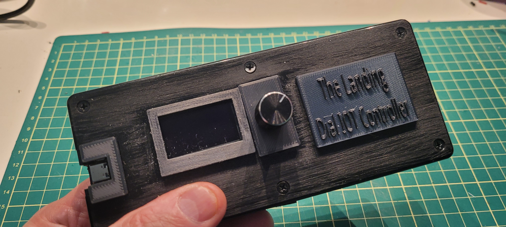
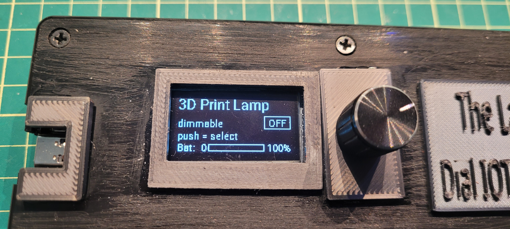

# MVdialer: a battery-powered "dial-a-device" remote for Home Assistant

## The problem I was actually trying to solve

Up at the lake I run everything through a Home Assistant Green — a growing pile of
landscape lighting (ESP32s and MOSFETs driving 12 V fixtures), bedroom lights, fans,
and whatever else I keep bolting on.

It all works great. For *me*.

The trouble is guests. When people visit the cottage, none of that automation is
theirs to touch. Sure, they could install the Home Assistant app, get an account,
get authorized, learn the dashboard... but most people don't want to do that, and
honestly they shouldn't have to. You're on vacation. You want to turn the lights
down, not onboard onto someone else's smart home.

So — another opportunity to automate.

What I wanted was something that felt like a *remote*: sitting on the counter,
battery powered, with a little screen and a knob. You scroll through the handful of
devices I've decided a guest should see, click to pick one, and turn it on, off, or
dim it. No phone. No login. No instructions taped to the fridge.

That idea became **MVdialer**.





## The parts, and why the ESP32-C3

I had most of the pieces on hand, which is half the reason it happened at all:

| Part            | What it is                                                                                                    |
| --------------- | ------------------------------------------------------------------------------------------------------------- |
| MCU board       | **DFRobot Beetle ESP32-C3 (DFR0868-A)** — 25 × 20.5 mm RISC-V board                                           |
| Input + display | **M75-1.3-OLED-bai** — an EC11 rotary encoder with push, a 1.3" OLED, and two side buttons, all as one module |
| OLED controller | SH1106, 128 × 64, monochrome (1-bit), I²C at address 0x3C                                                     |
| Power           | LiPo battery, charged over USB-C \[2400 MhA]                                                                  |

Having the OLED and encoder as a single module meant the display and the knob came
pre-wired together — one less thing to fuss over.

Two things sold me on the C3 for this. First, it's **even smaller than the old
ESP8266 boards** I usually reach for — the trade-off being fewer GPIO pins, which
turned out not to matter here. Second, and this is the good part: it has **on-board
LiPo charging**. Plug in the same USB-C you flash it with and the battery tops up.
That's what makes the whole thing genuinely cordless — you charge it like a phone
and forget about it.

\[EDITOR: rough total cost here if you want it — DIYers scroll for this first.]

## The build journey (a.k.a. where the interesting decisions were)

The hardware came together quickly. The part I actually spent time on — and the part
I think is worth sharing — was one deceptively simple question:

**How does the puck know which devices to show?**

I went through three answers.

**Attempt 1 — Home Assistant helpers.** The first suggested approach was to define the
device list using HA helpers. It works, but it felt cumbersome for something I'd be
editing casually. Too many clicks for "add a lamp."

**Attempt 2 — hardcode the list in the ESPHome YAML.** Simpler to reason about, and
faster to write. But now every time I added, removed, or renamed a device I had to
**recompile and re-flash the firmware.** For a device that's supposed to live at a
cottage I visit occasionally, that's exactly the wrong kind of friction.

**Attempt 3 — a plain text file served by Home Assistant.** This is where it clicked.
I put a simple text file in HA's `www` directory and let the puck fetch it. To add or
rename a device, I edit one line in a text file and wake the puck. **No recompile, no
OTA, no build machine at the cottage at all.**

That last option won for a reason I really like: it doesn't add a new point of
failure. The puck already depends on Home Assistant to actually *control* anything —
so hosting the device list on that same HA means if the list is reachable, control
is reachable, and if HA is down, well, there was nothing to control anyway. (More on
how it survives a bad fetch below.)

The other big win came late and surprised me: **deep sleep.** Before I enabled it,
the puck lasted 2–3 days on a charge. After — **more than a week**, which was my
actual design goal, because the cottage sits idle for a week at a time and I don't
want to babysit a battery. Same hardware, one architectural change, roughly a 3×
improvement in runtime.

## What it's like to use

You pick it up, give the knob a turn, and the screen lights up.

* **Turn** to scroll through the device list. Each entry shows its name, its type,
  and an ON/OFF badge so you can see the state *before* you touch anything.
* **Push** to act. An on/off device just toggles. A dimmable light turns on and drops
  you into a live brightness bar.
* **Keep turning** to dim or brighten, watching the bar move in real time.

That's the whole interface. One thumb, one knob, no side buttons to explain. A guest
can use it without being told how.

A couple of small touches that make it feel considerate rather than clever:

* **The first turn after sleep only wakes the screen** — it's swallowed, so you never
  accidentally change something just by rousing the puck.
* **It remembers where you left each light**, so turning one back on resumes it at its
  last brightness.
* **After ~20 seconds idle it quietly hands control back to the browse list** (the
  light stays where you set it), so the next thing you do is just pick another device.
* **After a longer idle the screen powers off and, if armed, the puck deep-sleeps**
  until you turn the knob again.

The puck holds no relays and no automation logic. It's purely a controller — every
action is a Home Assistant service call over the encrypted ESPHome↔HA API. If the
puck dies, nothing it controls is stranded; HA is always the source of truth.

## Where it lives, and moving it around

Right now MVdialer is built and running well. I've boxed it up so it survives cottage
life, and it's been holding its week-plus battery target in real use.

One design goal was that it should be **re-homeable** without a laptop. Because the
device list is just a text file served by HA, moving the puck to a different house is
a single change: point it at that home's Home Assistant IP. That HA serves the file
the same way and needs no extra software. There's nothing to compile on-site.

\[EDITOR: intro says the cottage runs an HA Green; some earlier docs say Yellow —
reconcile to one board before publishing.]

- - -

## Under the hood

*Everything below is the "how it's actually built" detail. Skip it unless you want the
wiring — the story above is the whole project.*

### The design principles it was measured against

* **Controller, not a hub.** The puck never owns device state. HA is the truth; the
  puck sends commands and reflects state. Small firmware, consistent behavior, nothing
  stranded by a puck fault.
* **Smart client, data-driven list.** The fast stuff (drawing, selection, live
  brightness) is local so the UI never lags. The slow-changing stuff (which devices
  appear) lives outside the firmware as data. Adding a device is a data edit, never a
  code change.
* **Sleep is a first-class feature.** The device spends almost all its life asleep. The
  whole architecture is shaped around sleeping hard, waking fast, and showing correct
  info the instant it wakes.
* **Always degrade gracefully.** A network hiccup, an HA reboot, or a bad edit to the
  list must never leave the puck blank or useless. Every external dependency has a
  local fallback.
* **Type-generic device model.** Lights come first, but internally a "device" is
  abstract, so switches, fans, and scenes can join later without reworking the core.

### The two modes

| Mode                     | Turn the knob                                | Push the knob                                      |
| ------------------------ | -------------------------------------------- | -------------------------------------------------- |
| **BROWSE**               | Move through the list (wraps, speed-limited) | Dimmable → enter CONTROL; on/off → toggle in place |
| **CONTROL** *(dimmable)* | Adjust brightness 0–100 %, live bar          | Turn the light **off** and return to BROWSE        |

### A session, start to finish

1. **Wake** — a knob turn wakes the puck (~1–2 s to reconnect Wi-Fi). The first input
   is swallowed so you don't change anything just by waking it.
2. **Browse** — turning moves the cursor; screen at medium brightness.
3. **Activate** — pushing a dimmable turns it on at its last level, flashes "ON," then
   reveals the brightness bar and brightens the screen.
4. **Control** — turning dims live; values are throttled to HA so a fast spin doesn't
   flood it, with a guaranteed final send when you stop.
5. **Auto-release** — after a short idle, control hands back to BROWSE (screen still
   on) so you can pick another device.
6. **Sleep** — after a longer idle the panel powers off and, if armed, the puck
   deep-sleeps until the next knob turn.

### The timers that shape the feel

| Timer                    | Default                     | Purpose                                               |
| ------------------------ | --------------------------- | ----------------------------------------------------- |
| Browse step throttle     | 250 ms                      | Caps scroll speed so a flick doesn't overshoot        |
| Brightness send throttle | 150 ms (leading + trailing) | Smooth dimming without flooding HA; final value lands |
| CONTROL auto-release     | 20 s                        | Idle in CONTROL → back to BROWSE, screen still on     |
| Panel-off / deep-sleep   | 60 s                        | Idle anywhere → screen off; deep-sleep if armed       |
| Battery heartbeat        | 12 h                        | Self-wake, report battery, sleep again                |

The 20 s release and 60 s sleep are deliberately independent: control is handed back
quickly while you're still looking at the screen, but the panel keeps its own longer
clock before going dark.

### The device list: data, not code

The list is a plain text file served by HA at `http://<ha-ip>/local/mvdialer.txt`,
one device per line:

```
# Name | type | entity_id      (type = dimmable | onoff)
3D Print Lamp | dimmable | light.esphome_web_be7938_3dprinter_lamp
Desk Spot     | onoff    | switch.tuya_2_desk_spot
```

To add, rename, or reorder a device you edit that file and wake the puck. That's it.

**Why a file, and why on HA.** Every other option hit a wall: a compiled-in list needs
a reflash per change; an HA `input_text` helper is capped at 255 characters; a
label-driven template is invisible in a plain editor. A text file has no length limit,
is trivially editable, updates live, and lives on the *same* HA the puck already
depends on — so it adds no new point of failure.

**Why a pinned local IP.** The URL points at HA's local IP on purpose — no DNS, no
remote/VPN path, always a plain local read. The puck is an ordinary Wi-Fi device with
no VPN client, so it can only reach HA locally anyway; pinning the IP just makes that
explicit and reliable.

**How failure is handled:**

1. On boot the puck loads the **last list it successfully fetched**, cached in flash,
   so the dial is populated *instantly* — before Wi-Fi is even up.
2. Once Wi-Fi connects it fetches the file; if the content changed, it re-parses and
   re-caches.
3. If the fetch fails, it keeps the last-known list. The dial is never blank.

On a brand-new puck that has never fetched, a small compiled-in default list covers
that first boot.

### Power & battery

The battery strategy is built entirely around deep sleep:

* After 60 s of no input the ESP32 enters deep sleep, drawing microamps, until you
  turn the knob or the 12-hour heartbeat wakes it to report battery and sleep again.
* Waking on a *turn* rather than a button is deliberate — no reaching for a side
  control, and the encoder's A channel sits on a wake-capable pin.
* In practice, sleep draw is dominated not by the CPU but by the battery-sense voltage
  divider. Everyday use (a handful of interactions a day, otherwise asleep) yields
  multi-week runtime per charge.

**Instant battery readout on wake.** Deep sleep wipes RAM, so a freshly woken puck
would show a blank gauge while its ADC settles. To avoid that, the last measured
voltage is persisted to flash and painted immediately on wake, then overwritten the
moment a fresh reading lands. Never blank, never stale for long.

**Dev-safe sleeping.** Deep sleep is gated behind a Home Assistant switch ("Sleep
Mode") that defaults **off**. On the bench the puck stays awake and reachable for
iteration and OTA; sleeping is only armed for deployment. The update path can never
be locked out by a sleeping device.

### ESP32-C3 features the design leans on

Built on ESP-IDF, this is where the chip earns its place:

* **Native USB Serial/JTAG** — first flash and all debug logging go straight over
  USB-C, no external UART adapter, and the hardware UART pins stay free for later.
* **Deep sleep with RTC-domain GPIO wake** — the encoder's A channel is on an
  RTC-capable pin, giving true turn-to-wake at microamp standby; a timer wake handles
  the 12-hour battery heartbeat.
* **Non-volatile storage (NVS)** — the persisted battery voltage and cached device
  list survive deep sleep *and* power loss. The list is stored as a single binary
  blob, which sidesteps the size limit on persisted strings and holds the whole list.
* **ADC1 battery sensing** — a resistor divider feeds an ADC1 channel; the firmware
  applies attenuation for full-scale range, oversamples to cut noise, and maps voltage
  to state-of-charge through a LiPo discharge curve.
* **Wi-Fi modem sleep + fast reconnect** — the radio naps between beacons and
  `fast_connect` skips the scan on wake, so reconnection is quick and cheap. The puck
  mostly *sends*, so a little inbound latency is invisible.
* **On-board LiPo charging** — charge over the same USB-C used to flash it.
* **Hardware I²C at 400 kHz** — drives the SH1106 128 × 64 OLED at a smooth ~8 fps.
* **GPIO interrupts with input filtering** — encoder and button use interrupt-driven
  inputs with internal pull-ups and short debounce, so detents and presses are caught
  reliably without polling.
* **Strapping-pin-aware pin map** — the I²C lines land on GPIO8/GPIO9 (strapping pins,
  but benign for I²C since strapping only matters at boot), and other boot-strapping
  pins are avoided, so the board always boots clean.

- - -

## Where it goes next

The type-generic device model is the seam for future capability. The nearest planned
extension is a **433 MHz RF ceiling fan**: a CC1101 sub-GHz transceiver on the board's
reserved SPI pins, captured and replayed through Home Assistant's RF platform, then
added to the dial like any other device — turn for speed, push for off. The OLED,
control loop, and device list need no structural change.

Beyond that, if it keeps proving itself, this feels like a real candidate for a proper
**PCB** instead of a hand-wired prototype.

It's still a prototype, and it looks like one — but it's enclosed enough to survive
cottage life, and there's a tiny mismatch between the on-screen mockup and the real
OLED in the video below that you won't notice in person. For a little idea that
started as "how do guests turn the lights down," it's working remarkably well.



