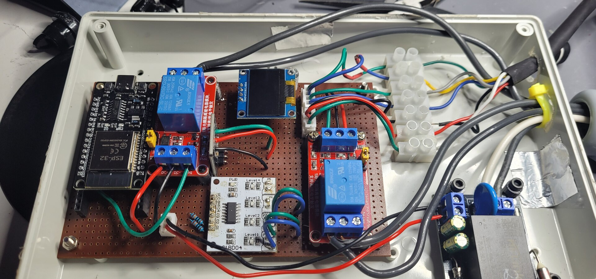
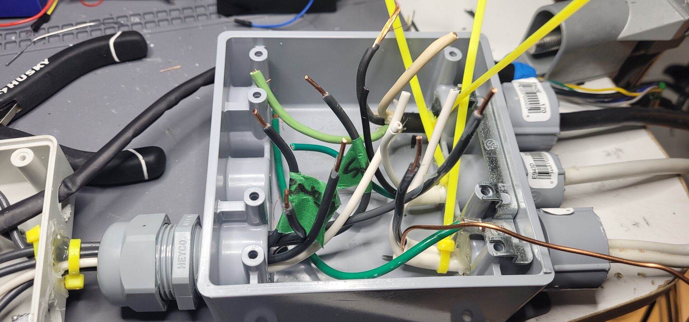
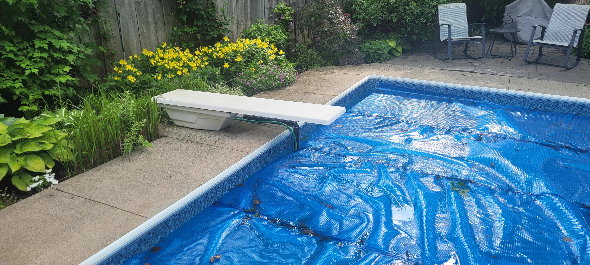
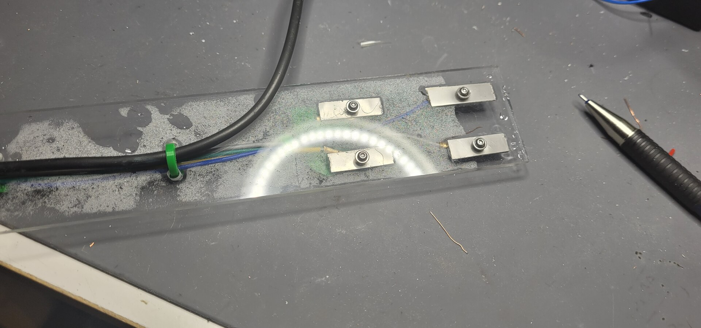
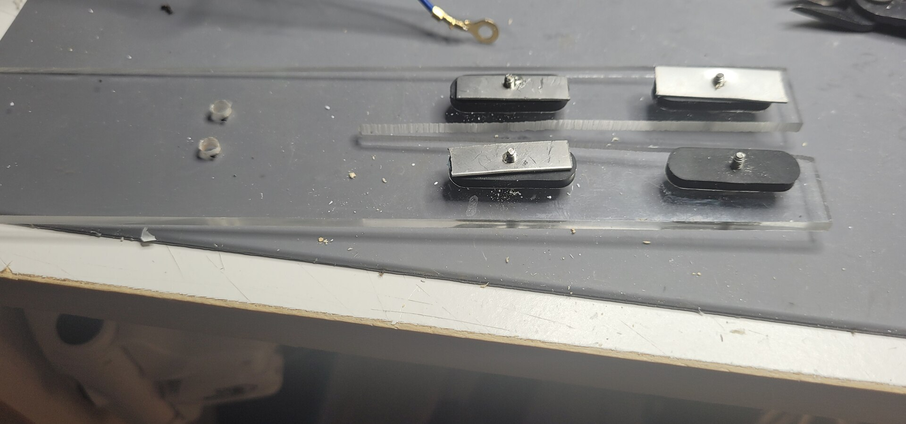

<!--
File: /mnt/NAS_Rpi5s2Area/poolsysv9_blog_draft.md
Project: poolsysv9 (ESP32 pool monitor + fill + lights, ESPHome/Home Assistant)
Date created: 2026-07-01
Prepared by: Claude (Opus 4.8, 1M context) for mviggylab@gmail.com

TODO before publishing:
  - Confirm the stainless grade of the electrodes (build notes recommend 316 for salt water; DS18B20 sheath is 304). Do NOT publish "301" unless that is truly what was cut.
  - Drop real photos/diagrams at the \[PHOTO:] / \[DIAGRAM:] markers. Existing figures:
      poolsysv9_wiring_fig2_2026-06-10.svg   (controller wiring)
      poolsysv9_cartridge_fig3_2026-06-10.svg (dimensioned cartridge)
-->

## What I wanted to measure

When I set out, the things I thought would actually be useful to know were: **pool and outside temperature, humidity, and whether the water level was creeping too high — or worse, dropping too low.** I also wanted a way to *fill* the pool remotely, for convenience or when I'm away.

I know remote-filling a pool sounds risky. My rule was to only do it within a "get-home-in-a-few-hours" radius — cottage distance, not vacation distance — and always with someone at the house who could shut the water off manually if something went sideways. Automation is a safety net, not a babysitter.

## Why bother — the $3,000 lesson

Two reasons this wasn't just a gadget.

First, **I'd had a leak once that nearly ran the pump dry.** A dry pump is a +$3,000 mistake, and I'd rather spend a weekend with an ESP32 than a paycheck on a pump.

Second, **too *much* water is its own problem.** If rain or a forgotten hose pushes the level over the edge, water can get in behind the liner — or make its way toward the house. I wanted to know *well before* either happened.

Temperature was more my wife's request than mine: she likes to know it's swim-worthy before she commits in the morning. For the record, I've been reliably informed that **80°F is the happy-wife threshold** — and, conveniently, I can no longer *exaggerate* the reading to lure her in.

Finally, I wanted a **little display on the controller** for a quick glance when my phone isn't handy.

> ⚠️ **One safety note up front:** this project mixes low-voltage sensors with **120 V line power** (relays, a solenoid, pool lighting). The 5 V DC sensor side is harmless. The line-voltage side is not. More on this at the end — but if you're not fully comfortable with household AC, **hire an electrician**. In many areas, anything near a pool is legally required to be.

## First iteration

The hard design problems were the usual suspects: **power safety** for the fill solenoid, **weatherproofing** the electronics, **corrosion resistance**, and the **~10 ft distance** between the controller and the pool.

**Sensing water depth.** There are fancy touch-less options and tank-style approaches, but I wanted simple. I used a **4-channel conductive water-level board (LC1BD04)** — a few dollars on AliExpress — and only needed two of its channels.

The way it works: you place bare-wire electrode pairs at fixed heights. The board pushes a tiny voltage out one electrode; when water rises and touches the pair, the water bridges the gap to the common return. That drops the resistance, current flows, an onboard transistor trips, and the matching output pin flips. Set one pair at your "too high" mark and one at your "too low" mark and you've got level sensing for pocket change.

**Water temperature** came from a **DS18B20 stainless-steel probe.** Between the level electrodes and the temp sensor, I needed seven conductors to reach the pool. I got lucky and could run a length of corrugated conduit from the controller down to the poolside, tucked in next to my old-school diving board, with the fill hose running alongside it from the solenoid. To keep it from looking *too* DIY, I hid the electrode ends and thermometer inside a piece of PEX — small, tidy, and it held up.

For the display I used a basic **0.96" OLED** showing pool temp, local temp, and water-level status.

### The v1 automations

Home Assistant watched the levels and notified me. The one non-negotiable rule was a **critical failsafe: shut the solenoid off after 30 minutes of run time, no matter what turned it on.**

### The experience — two seasons in

This is the part that actually matters: *what does the system feel like to live with?* Honestly, great. The solenoid timeout saved me from myself more than once, and the level alerts caught problems early. My wife lost the ability to accuse me of temperature inflation, which she considers a net positive.

**But** — after two seasons, **corrosion destroyed the level-sensor wires** and the system needed a rebuild. Why? I simply hadn't thought it through. **I didn't appreciate how aggressively salt-water pool chemistry attacks copper and solder joints.** Lesson logged.

## Second iteration

Two seasons of use gave me a clear punch list. I also had **Claude Code in the loop** this time to pressure-test the design, which caught a few things.

The goals for v2:

* **One brain, one enclosure.** In v1 the pool lights were on a *separate* controller — annoying. I folded them in by adding a second **30 A / 240 V SLA-05VDC-SL-C relay** so the lights are switchable and controllable from HA like everything else.
* **A serviceable sensor cartridge.** Instead of electrodes glued into place, I built a **stilling well** — a vertical PVC pipe with a 90° elbow feeding into the pool — housing all the sensors in a *pluggable cartridge* I can pull and replace when corrosion inevitably wins again.
* **Fix the electronics flaws.** Claude flagged that my original contact wiring left the output pins floating in undefined states. I added **pull-down resistors** so the outputs read a clean LOW while the board is powered down.
* **Stop cooking the electrodes.** In v1 I powered the level board 24/7. But nothing about pool level changes fast, so there's no reason to. Now the ESP32 **powers the board only to take a reading — roughly 350 ms every 30 seconds when idle, and every 5–10 seconds while filling** (a ~1% duty cycle). Less time energized in salt water means dramatically less electrolysis. My first instinct was a MOSFET to switch it, but the LC1BD04 draws only 7–12 mA and runs fine at 3.3 V — so I just **power it straight from an ESP32 GPIO**, and that pin *is* the on/off switch. Bonus: at 5 V the board's output swings to 3.7 V, which is over the ESP32's ~3.6 V pin limit; running it at 3.3 V also keeps the logic level safely in range.

### New design features

* **Pool lights** brought onto the controller as a switchable, HA-controllable relay.
* **Pluggable cartridge** in a vertical PVC stilling well with a 90° deck elbow — all sensors live inside and it unplugs at an **8-pin IP67 aviation connector** for service.
* **Upgraded electrodes** to stainless steel with stainless terminals *(note: confirm grade — salt water really wants 316)*, sealing only the copper joints and leaving the sensing faces bare.
* **Cleaner firmware** — the duty-cycled level power, the lights relay, and a tighter fill failsafe.
* **Lights status added to the OLED** as a quick indicator.

The v2 fill logic also got smarter: it **stops the moment the HIGH electrode goes wet, or after 15 minutes, whichever comes first** — belt and suspenders, on the device itself so it works even if HA is down.

### The bug I didn't see coming

I commissioned the new cartridge, sat back… and got **false "full" readings.** The culprit wasn't the pool — it was **condensation.** The stilling well traps warm, humid air above the water, and that moisture condensed on the plexiglass the electrodes were mounted to. A thin film across that flat surface was enough to bridge the electrode gap and fool the board into reporting water that wasn't there.

I fixed it three ways at once, because in a humid pool environment one alone wasn't enough:

1. **Vent slits** in the upper elbow to let the trapped humid air escape.
2. **Split the plexiglass carrier down the middle** between the electrodes, so there's no continuous surface for a film to bridge across.
3. **Stood each electrode off the plexiglass on rubber washers**, so even leftover condensation can't touch the metal — the only path left is *real* water.

A week later the readings are rock-steady. It was a good reminder that the same lesson comes back in new clothes: **the pool environment will find every shortcut you took.**

\[PHOTO: cartridge with vent slits + split carrier — the fix]

## Where it landed

It's in production now: one controller, pool lights and fill on HA, an on-device failsafe that doesn't trust the network, duty-cycled sensing that should outlast v1 by years, and a **spare cartridge already built** so the next corrosion event is a five-minute swap instead of a rebuild.

## ⚠️ The one caveat that matters most

If you're **not** genuinely comfortable working with household AC and how things connect to it, **don't** — get an electrician to do that part. Depending on your local electrical code, near a pool it may be a legal requirement. The pool-side sensors are harmless 5 V DC. But at the controller — the solenoid, the relays, the pool-light wiring — you want it **safe and certified.** I also modified my AC-to-DC converter (a Hi-Link HLK-PM01) with an added **fuse and thermal protection** rather than trusting a bare module. Respect the line voltage.

## Parts list

* ESP32
* 30 A / 240 V max **SLA-05VDC-SL-C** relay (×2 — solenoid + lights)
* 0.96" OLED
* **DS18B20** stainless-steel waterproof temperature probe
* **LC1BD04** 4-channel conductive level board (2 channels used)
* **HLK-PM01** 240 VAC → 5 VDC converter *(modified: added fuse + thermal protection)*
* Fill solenoid valve + hose fittings
* 8-pin IP67 aviation connector
* Stainless electrodes + stainless screw terminals
* PVC stilling well (pipe + 90° elbow) and plexiglass electrode carrier
* Pull-down resistors (output pins), 4.7 kΩ pull-up (DS18B20)
* Hookup wire, heat-shrink, neutral-cure silicone

*Optional GPIO map — Solenoid GPIO5, Lights GPIO23, Level-board power GPIO16, level outputs GPIO21/GPIO18, DS18B20 data GPIO17.*
